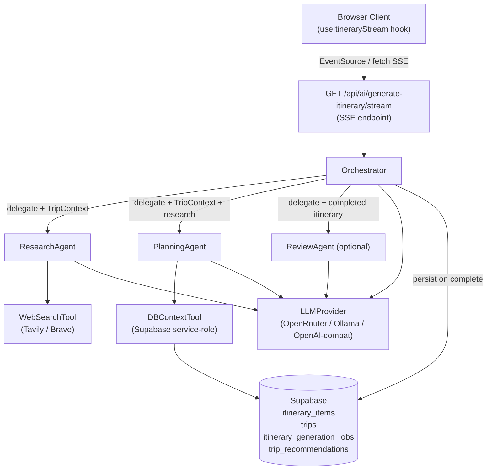

# Design Document: AI Itinerary Agent

## Overview

The AI Itinerary Agent replaces the current fire-and-forget POST + polling pattern with a streaming multi-agent pipeline. Instead of a single monolithic prompt that runs in the background and requires polling to detect completion, the new system opens a Server-Sent Events (SSE) connection and streams real-time progress events — agent thoughts, tool calls, partial day plans — directly to the client as they happen.

The architecture introduces three focused agents (Orchestrator, ResearchAgent, PlanningAgent) plus an optional ReviewAgent, a pluggable LLM provider abstraction, two agent-callable tools (WebSearchTool, DBContextTool), and two new API endpoints for `@AI` chat assistance and single-day partial replanning. All existing display components (`AIItineraryDisplay`, `ItineraryStatusNotification`, calendar views) continue to work without modification because the new pipeline writes to the same Supabase schema.

### Key Design Decisions

- **SSE over WebSockets**: Next.js App Router supports `ReadableStream` natively; SSE is simpler, stateless, and sufficient for unidirectional server→client streaming.
- **Agent emitter pattern**: Agents call `emitter.emit(event)` rather than returning all events at once, enabling true streaming without buffering the full output.
- **Job record as audit trail only**: `itinerary_generation_jobs` transitions through `pending → streaming → completed/failed` but is not the primary progress mechanism — SSE is. The job record enables reconnection fallback via the existing `/api/ai/status/[jobId]` endpoint.
- **Zod validation at boundaries**: Every LLM output is validated against a Zod schema before being emitted to the client or persisted, catching malformed responses early.
- **Provider abstraction via factory**: A single `createLLMProvider()` factory reads `AI_PROVIDER` at runtime and returns the appropriate concrete implementation, keeping agents fully decoupled from provider SDKs.

---

## Architecture



### Request Flow

1. Client calls `GET /api/ai/generate-itinerary/stream?tripId=<id>` with auth cookie.
2. Route handler verifies trip membership, creates a job record (`pending`), opens a `ReadableStream`, and returns it immediately with `Content-Type: text/event-stream`.
3. Orchestrator is instantiated with the stream emitter and an `AbortController`. Job status is updated to `streaming`.
4. Orchestrator calls `DBContextTool` to assemble `TripContext`, then delegates to `ResearchAgent`.
5. `ResearchAgent` calls `WebSearchTool` for each destination, emitting `tool_call` / `tool_result` events, then returns `AgentResult` with research summary.
6. Orchestrator hands off to `PlanningAgent` with `TripContext` + research results. `PlanningAgent` emits `partial_itinerary` events as each day is completed.
7. If `ENABLE_REVIEW_AGENT=true`, Orchestrator delegates to `ReviewAgent` which validates constraints and may trigger re-planning of flagged days.
8. Orchestrator persists itinerary items to Supabase, updates `trips` and `itinerary_generation_jobs`, emits `itinerary_complete`, and closes the stream.

### @AI Chat Flow

1. `TripChat` detects `@AI` prefix (case-insensitive) and POSTs to `/api/ai/chat` instead of broadcasting via Supabase Realtime.
2. Chat endpoint loads `TripContext`, builds message history (last 10 `@AI` exchanges), streams response as SSE.
3. AI response tokens are rendered inline in the chat thread as they arrive.
4. Completed response is persisted to `trip_messages` with `message_type = 'ai_response'`.

---

## Components and Interfaces

### Agent Interface

```typescript
// src/services/ai/types.ts
interface Agent {
  run(context: AgentRunContext, emitter: StreamEmitter): Promise<AgentResult>;
}

interface AgentRunContext {
  tripContext: TripContext;
  researchResults?: ResearchResult[];   // provided to PlanningAgent
  existingItinerary?: ParsedItinerary;  // provided for partial replan
  dayNumber?: number;                   // partial replan target
  reason?: string;                      // partial replan reason
  abortSignal: AbortSignal;
}

interface StreamEmitter {
  emit(event: StreamEvent): void;
}
```

### LLMProvider Interface

```typescript
// src/services/ai/providers/index.ts
interface LLMProvider {
  streamChat(
    messages: LLMMessage[],
    tools?: ToolDefinition[],
    signal?: AbortSignal,
  ): AsyncIterable<string>;
}

interface LLMMessage {
  role: 'system' | 'user' | 'assistant' | 'tool';
  content: string;
  toolCallId?: string;
}

// Factory — reads AI_PROVIDER env var
function createLLMProvider(): LLMProvider;
```

Concrete implementations: `OpenRouterProvider`, `OllamaProvider`, `OpenAICompatibleProvider` (covers lmstudio, anythingllm).

### Tool Interface

```typescript
interface Tool<TInput = unknown, TOutput = unknown> {
  name: string;
  description: string;
  schema: z.ZodSchema<TInput>;
  execute(input: TInput, signal?: AbortSignal): Promise<ToolResult<TOutput>>;
}

interface ToolResult<T = unknown> {
  success: boolean;
  data?: T;
  error?: string;
}
```

### Orchestrator

`src/services/ai/orchestrator.ts` — coordinates the full pipeline:

```typescript
class Orchestrator {
  constructor(
    private provider: LLMProvider,
    private emitter: StreamEmitter,
    private abortController: AbortController,
  ) {}

  async run(tripId: string): Promise<void>;
}
```

Responsibilities:
- Assemble `TripContext` via `DBContextTool`
- Delegate to `ResearchAgent`, `PlanningAgent`, optionally `ReviewAgent`
- Emit `agent_handoff` events at each delegation
- Persist completed itinerary to Supabase
- Catch all errors and emit `error` event before closing stream

### ResearchAgent

`src/services/ai/agents/researchAgent.ts`

- Calls `WebSearchTool` once per destination (minimum)
- Emits `agent_thought` events for each search step
- Returns `AgentResult` containing structured research summary passed to `PlanningAgent`

### PlanningAgent

`src/services/ai/agents/planningAgent.ts`

- Reads `TripContext` (already assembled by Orchestrator)
- Incorporates research results and co-traveler recommendations
- Generates itinerary day-by-day, emitting `partial_itinerary` after each day
- Validates each day against `ParsedItineraryDaySchema` (Zod); retries LLM call up to 2× on validation failure
- Ensures exactly N days with no gaps

### ReviewAgent (feature-flagged)

`src/services/ai/agents/reviewAgent.ts`

- Enabled when `ENABLE_REVIEW_AGENT=true`
- Validates completed itinerary against dietary restrictions, budget, must-do activities
- Flags violations and triggers targeted re-planning for affected days

### WebSearchTool

`src/services/ai/tools/webSearchTool.ts`

- Reads `SEARCH_PROVIDER` (`tavily` | `brave`) and corresponding API key
- Strips PII from queries before sending to external API
- Times out after 10 seconds; returns empty result set on failure with error in `tool_result` event

### DBContextTool

`src/services/ai/tools/dbContextTool.ts`

- Uses Supabase service-role client
- Assembles full `TripContext` from `trips`, `trip_members`, `profiles`, `itinerary_items`, `bookings`
- Times out after 5 seconds
- Throws `TripNotFoundError` or `ContextTimeoutError` on failure

### RecommendationService

`src/services/recommendations/recommendationService.ts`

```typescript
class RecommendationService {
  async getForTrip(tripId: string, userId: string): Promise<TripRecommendation[]>;
  async saveRecommendation(input: SaveRecommendationInput): Promise<void>;
}
```

Ranking logic: co-traveler's trip count to exact destination (desc) → total trip count (desc). Returns at most 3 results. Only surfaces recommendations from users who share at least one trip with the requesting user.

### New React Hooks

**`useItineraryStream`** (`src/hooks/useItineraryStream.ts`)
- Opens `EventSource` to `/api/ai/generate-itinerary/stream?tripId=...`
- Exposes: `events`, `status`, `itinerary`, `cancel()`
- Replaces `useItineraryGeneration` + `useItineraryStatus` as primary interface
- Old hooks remain functional for backward compatibility

**`useCoTravelerRecommendations`** (`src/hooks/useCoTravelerRecommendations.ts`)
- React Query wrapper around `GET /api/recommendations?tripId=...`
- Returns ranked `TripRecommendation[]`

### New UI Components

**`StreamingThinkingPanel`** (`src/components/itinerary/StreamingThinkingPanel.tsx`)
- Displays current agent name + latest `agent_thought` text
- Collapsible timeline log of all past thoughts
- Animates between successive thoughts
- Collapses automatically on `itinerary_complete`

**`PartialDayCard`** (`src/components/itinerary/PartialDayCard.tsx`)
- Renders a single `partial_itinerary` event payload as a day card
- Shown alongside `StreamingThinkingPanel` during generation

**`TripRecommendationPrompt`** (`src/components/trip/TripRecommendationPrompt.tsx`)
- Post-trip modal prompting each member to leave up to 3 recommendations
- Shown when trip end date has passed and user hasn't submitted recommendations yet

---

## Data Models

### StreamEvent (discriminated union)

```typescript
// src/services/ai/types.ts

type StreamEvent =
  | { type: 'agent_start';      timestamp: string; agentName: string }
  | { type: 'agent_thought';    timestamp: string; agentName: string; thought: string }
  | { type: 'tool_call';        timestamp: string; toolName: string; input: unknown }
  | { type: 'tool_result';      timestamp: string; toolName: string; summary: string; success: boolean }
  | { type: 'agent_handoff';    timestamp: string; fromAgent: string; toAgent: string; task: string }
  | { type: 'partial_itinerary'; timestamp: string; day: ParsedItineraryDay }
  | { type: 'itinerary_complete'; timestamp: string; itinerary: ParsedItinerary }
  | { type: 'error';            timestamp: string; message: string; recoverable: boolean };
```

### AgentResult

```typescript
interface AgentResult {
  agentName: string;
  success: boolean;
  data?: unknown;          // ResearchResult[] for ResearchAgent, ParsedItinerary for PlanningAgent
  error?: string;
  durationMs: number;
  tokenCount?: number;
}
```

### TripContext

```typescript
interface TripContext {
  trip: {
    id: string;
    name: string;
    destinations: string[];
    startDate: string;
    endDate: string;
    tripLengthDays: number;
    travelStyle: string;
    vibe: string;
    budget: 'low' | 'mid' | 'high';
    activityLevel: 'light' | 'moderate' | 'active';
    mustDoActivities: string[];
    description: string;
  };
  members: Array<{
    profileId: string;
    interests: string[];
    dietaryRestrictions: string[];
  }>;
  aggregatedDietary: string[];
  existingItineraryItems: ItineraryItem[];
  bookings: Booking[];
  coTravelerRecommendations: TripRecommendation[];
}
```

### TripRecommendation

```typescript
interface TripRecommendation {
  id: string;
  tripId: string;
  userId: string;
  recommenderName: string;   // display name for attribution
  destination: string;
  text: string;
  createdAt: string;
}
```

### Renamed types (replacing N8N* names)

```typescript
// src/services/ai/types.ts — replaces src/types/n8n.ts

interface TripPlanRequest {
  tripDetails: TripContext['trip'];
  travelers: TripContext['members'];
  globalPreferences: { dietary: string[] };
}

interface ItineraryOutput {
  hotelRecommendations: HotelRecommendation[];
  itinerary: ParsedItineraryDay[];
  closingNote: string;
}
```

`ParsedItinerary` and `ParsedItineraryDay` remain in `src/services/itineraryService.ts` unchanged to preserve `AIItineraryDisplay` compatibility.

### LLMProviderError

```typescript
class LLMProviderError extends Error {
  constructor(
    public provider: string,
    public statusCode: number,
    public rawBody: string,
  ) {
    super(`LLM provider '${provider}' returned ${statusCode}`);
  }
}
```

---

## API Contracts

### GET /api/ai/generate-itinerary/stream

Query params: `tripId: string`

Auth: session cookie (verified against `trip_members`)

Response: `Content-Type: text/event-stream`

Each SSE event: `data: <JSON StreamEvent>\n\n`

Error responses (before stream opens): `403` (not a member), `404` (trip not found), `400` (missing tripId).

### POST /api/ai/chat

```typescript
// Request
{ tripId: string; message: string; history: Array<{ role: 'user' | 'assistant'; content: string }> }

// Response: text/event-stream
// Emits agent_thought and itinerary_complete events, plus a final ai_message event:
{ type: 'ai_message'; timestamp: string; content: string }
```

### POST /api/ai/replan

```typescript
// Request
{ tripId: string; dayNumber: number; reason?: string }

// Response: text/event-stream (same StreamEvent protocol)
// Emits partial_itinerary for the replanned day, then itinerary_complete
```

Error: `400` if `dayNumber` does not exist in current itinerary.

### GET /api/ai/status/[jobId] (unchanged — reconnection fallback)

Returns `itinerary_generation_jobs` row as JSON.

---

## Database Schema Changes

### New table: `trip_recommendations`

```sql
create table trip_recommendations (
  id          uuid primary key default gen_random_uuid(),
  trip_id     uuid references trips(id) on delete cascade not null,
  user_id     uuid references profiles(id) on delete cascade not null,
  destination text not null,
  text        text not null,
  created_at  timestamptz default now() not null
);

create index trip_recommendations_trip_id_idx on trip_recommendations(trip_id);
create index trip_recommendations_user_id_idx on trip_recommendations(user_id);
create index trip_recommendations_destination_idx on trip_recommendations(destination);

alter table trip_recommendations enable row level security;

-- Members can read recommendations for trips they belong to
create policy "trip members can read recommendations"
  on trip_recommendations for select
  using (
    exists (
      select 1 from trip_members
      where trip_members.trip_id = trip_recommendations.trip_id
        and trip_members.profile_id = auth.uid()
        and trip_members.invitation_status = 'accepted'
    )
  );

-- Users can insert their own recommendations
create policy "users can insert own recommendations"
  on trip_recommendations for insert
  with check (user_id = auth.uid());
```

### Update `itinerary_generation_jobs` status enum

Add `streaming` and `cancelled` to the status check constraint (or enum type):

```sql
-- If status is a text column with a check constraint:
alter table itinerary_generation_jobs
  drop constraint if exists itinerary_generation_jobs_status_check;

alter table itinerary_generation_jobs
  add constraint itinerary_generation_jobs_status_check
  check (status in ('pending', 'streaming', 'processing', 'completed', 'failed', 'cancelled', 'cleared'));
```

### No other schema changes required

`itinerary_items`, `trips`, `trip_members`, `profiles`, and `trip_messages` columns are unchanged. The new pipeline writes to the same columns as the current implementation.

---

## Correctness Properties

*A property is a characteristic or behavior that should hold true across all valid executions of a system — essentially, a formal statement about what the system should do. Properties serve as the bridge between human-readable specifications and machine-verifiable correctness guarantees.*


### Property 1: SSE opens before agent work begins

*For any* itinerary generation request, the streaming HTTP response (SSE connection) must be established and the first byte sent to the client before any `agent_start` event timestamp is recorded.

**Validates: Requirements 1.1**

---

### Property 2: Every delegation produces an agent_handoff event

*For any* orchestrator run, every delegation to a sub-agent must produce exactly one `agent_handoff` event in the stream containing the receiving agent's name and a non-empty task description.

**Validates: Requirements 1.2, 2.1**

---

### Property 3: agent_thought events contain required fields

*For any* `agent_thought` event emitted on the stream, the event must contain a non-empty `agentName` string and a non-empty `thought` string.

**Validates: Requirements 1.3**

---

### Property 4: Tool call/result round-trip ordering

*For any* tool invocation during an agent run, the event stream must contain a `tool_call` event for that tool appearing strictly before the corresponding `tool_result` event, and both events must reference the same tool name.

**Validates: Requirements 1.4, 1.5**

---

### Property 5: Partial itinerary events match trip day count

*For any* trip of N calendar days, the number of `partial_itinerary` events emitted during a full generation run must equal exactly N.

**Validates: Requirements 1.6, 2.8, 12.1, 12.2**

---

### Property 6: itinerary_complete is the terminal event

*For any* successful generation run, the `itinerary_complete` event must be the last event emitted on the stream, and no further events must appear after it.

**Validates: Requirements 1.7**

---

### Property 7: Errors produce an error event and close the stream

*For any* unrecoverable agent error, the stream must emit exactly one `error` event with a non-empty `message` string, and no further events must appear after it.

**Validates: Requirements 1.8**

---

### Property 8: Events are in strictly ascending timestamp order

*For any* sequence of events emitted on a stream, each event's `timestamp` must be greater than or equal to the timestamp of the preceding event (no out-of-order delivery).

**Validates: Requirements 1.9**

---

### Property 9: ResearchAgent calls WebSearchTool at least once per destination

*For any* trip with N destinations, the event stream must contain at least N `tool_call` events for `WebSearchTool` before the `agent_handoff` event delegating to `PlanningAgent`.

**Validates: Requirements 2.2, 4.5**

---

### Property 10: DBContextTool is called before any partial_itinerary event

*For any* generation run, the `tool_call` event for `DBContextTool` must appear in the stream before the first `partial_itinerary` event.

**Validates: Requirements 2.3**

---

### Property 11: ReviewAgent handoff precedes itinerary_complete when feature is enabled

*For any* generation run where `ENABLE_REVIEW_AGENT=true`, the event stream must contain an `agent_handoff` event to `ReviewAgent` appearing before the `itinerary_complete` event.

**Validates: Requirements 2.5**

---

### Property 12: LLMProvider factory returns correct type for each AI_PROVIDER value

*For any* valid `AI_PROVIDER` value (`openrouter`, `ollama`, `lmstudio`, `anythingllm`, `openai-compatible`), the `createLLMProvider()` factory must return an instance of the corresponding concrete provider class. For unrecognised or missing values, it must return an `OpenRouterProvider` instance.

**Validates: Requirements 3.1, 3.5**

---

### Property 13: LLMProviderError contains provider name, status code, and raw body

*For any* HTTP error response from any LLM provider, the thrown error must be an instance of `LLMProviderError` with non-empty `provider`, a numeric `statusCode`, and a non-empty `rawBody` string.

**Validates: Requirements 3.7**

---

### Property 14: WebSearchTool results are structurally valid and bounded

*For any* search query, the returned result array must have length <= 10, and each result must contain non-empty `title`, `url`, and `snippet` strings.

**Validates: Requirements 4.1**

---

### Property 15: WebSearchTool returns empty results on API failure

*For any* search API error or timeout, the `WebSearchTool` must return an empty array and the corresponding `tool_result` stream event must have `success: false` with a non-empty error description.

**Validates: Requirements 4.4**

---

### Property 16: WebSearchTool strips PII from queries

*For any* query string containing PII patterns (email addresses, profile UUIDs, phone numbers), the sanitised query sent to the external search API must not contain those patterns.

**Validates: Requirements 4.6, 13.4**

---

### Property 17: DBContextTool returns complete TripContext

*For any* valid trip ID, the `TripContext` returned by `DBContextTool` must contain all required fields: `trip`, `members`, `aggregatedDietary`, `existingItineraryItems`, `bookings`, and `coTravelerRecommendations`.

**Validates: Requirements 5.1**

---

### Property 18: DBContextTool throws TripNotFoundError for missing trips

*For any* trip ID that does not exist in the database, `DBContextTool` must throw a `TripNotFoundError` (not a generic error or null return).

**Validates: Requirements 5.4**

---

### Property 19: Completed itinerary is fully persisted to Supabase

*For any* successful generation run, after `itinerary_complete` is processed: (a) `itinerary_items` must contain one row per activity in the itinerary, (b) the `trips` row must have `itinerary_status = 'completed'`, non-null `ai_itinerary_data`, non-null `hotel_recommendations`, and non-null `itinerary_generated_at`.

**Validates: Requirements 6.1, 6.2**

---

### Property 20: Job status follows valid transition sequence

*For any* generation run, the `itinerary_generation_jobs` row must transition through statuses in the order: `pending` → `streaming` → (`completed` | `failed`). No status may be skipped and no backward transitions may occur.

**Validates: Requirements 6.3**

---

### Property 21: New pipeline output conforms to ParsedItinerary interface

*For any* itinerary produced by the new agent pipeline, the output object must satisfy the `ParsedItinerary` TypeScript interface (i.e., it must be accepted by `AIItineraryDisplay` without type errors).

**Validates: Requirements 6.4**

---

### Property 22: Failed job record has error_message and completed_at

*For any* generation run that ends in failure, the `itinerary_generation_jobs` row must have `status = 'failed'`, a non-empty `error_message`, and a non-null `completed_at` timestamp.

**Validates: Requirements 6.6, 14.2**

---

### Property 23: Partial replan emits exactly one partial_itinerary for the target day

*For any* partial replan request for day D, the event stream must contain exactly one `partial_itinerary` event with `day.day === D` and zero `partial_itinerary` events for any other day number.

**Validates: Requirements 7.1**

---

### Property 24: Partial replan only modifies target day's itinerary_items rows

*For any* partial replan of day D, the `itinerary_items` rows for all days other than D must be identical before and after the replan (same IDs, same content).

**Validates: Requirements 7.3**

---

### Property 25: Partial replan returns 400 for non-existent day numbers

*For any* partial replan request where `dayNumber` is not in the set `{1, ..., N}` for the current itinerary, the endpoint must return HTTP 400 with a non-empty descriptive error message.

**Validates: Requirements 7.5**

---

### Property 26: @AI prefix routing is case-insensitive

*For any* chat message where the trimmed content starts with `@ai`, `@AI`, `@Ai`, or any other case variant, the `TripChat` component must route the message to the AI chat endpoint and not broadcast it via Supabase Realtime.

**Validates: Requirements 8.1**

---

### Property 27: AI chat history window is bounded to 10 exchanges

*For any* AI chat session with more than 10 prior `@AI` exchanges, the message history passed to the LLM must contain at most 10 exchanges (20 messages: 10 user + 10 assistant).

**Validates: Requirements 8.6**

---

### Property 28: AI chat responses are persisted with ai_response message type

*For any* AI chat response, the row inserted into `trip_messages` must have `message_type = 'ai_response'` and a non-empty `content` field.

**Validates: Requirements 8.8**

---

### Property 29: Cancel transitions job to cancelled status

*For any* active generation job, calling `cancel()` on the `useItineraryStream` hook must result in the `itinerary_generation_jobs` row having `status = 'cancelled'`.

**Validates: Requirements 9.5, 14.3**

---

### Property 30: Planning_Agent retries on schema validation failure

*For any* LLM response that fails `ParsedItineraryDay` Zod validation, the `PlanningAgent` must retry the LLM call, up to a maximum of 2 retries, before emitting a stream `error` event.

**Validates: Requirements 10.2**

---

### Property 31: partial_itinerary events pass schema validation before emission

*For any* `partial_itinerary` event, the `day` payload must pass `ParsedItineraryDaySchema` Zod validation before the event is written to the stream.

**Validates: Requirements 10.3**

---

### Property 32: ParsedItinerary serialization round-trip

*For any* valid `ParsedItinerary` object, serializing it with the Pretty_Printer and then parsing the result must produce an object that is deeply equal to the original.

**Validates: Requirements 10.4, 10.5**

---

### Property 33: LLM output cleaning removes markdown fences and whitespace

*For any* string that starts with ` ``` ` (with optional language tag) or has leading/trailing whitespace, the cleaning function must return a string that does not start with ` ``` `, has no leading whitespace, and has no trailing whitespace.

**Validates: Requirements 10.6**

---

### Property 34: Planning prompt includes all dietary restrictions

*For any* `TripContext` with N dietary restrictions, the planning prompt string passed to the LLM must contain all N dietary restriction strings.

**Validates: Requirements 11.1**

---

### Property 35: Activities per day are within the required range

*For any* generated `ParsedItineraryDay`, the number of activities must be between 3 and 6 (inclusive).

**Validates: Requirements 12.3**

---

### Property 36: Endpoints return 403 for non-members

*For any* request to the generation, chat, or replan endpoints from a user who is not an accepted member of the specified trip, the response must be HTTP 403.

**Validates: Requirements 13.1, 13.2**

---

### Property 37: Structured log entries contain all required fields

*For any* phase transition logged by the Orchestrator, the log entry object must contain non-null `jobId`, `agentName`, `phase`, and `durationMs` fields.

**Validates: Requirements 14.1**

---

### Property 38: Stalled streaming jobs are timed out after 180 seconds

*For any* job that remains in `streaming` status for more than 180 seconds, the system must automatically update its status to `failed` with `error_message = 'Generation timeout'`.

**Validates: Requirements 14.5**

---

### Property 39: Co-traveler relationship is symmetric

*For any* two users A and B who have both been accepted members of the same trip, both `isCoTraveler(A, B)` and `isCoTraveler(B, A)` must return true.

**Validates: Requirements 15.2**

---

### Property 40: Recommendations use exact destination matching and co-traveler filtering

*For any* recommendation query for destination X by user U, every returned recommendation must satisfy: (a) `recommendation.destination === X` (exact string equality), and (b) the recommending user must be a co-traveler of U (shares at least one accepted trip).

**Validates: Requirements 15.3, 15.5, 15.9**

---

### Property 41: At most 3 recommendations are surfaced, in correct ranking order

*For any* recommendation query, the result set must have length <= 3, and if multiple recommendations exist, they must be ordered by (1) recommender's trip count to that destination descending, then (2) recommender's total trip count descending.

**Validates: Requirements 15.4**

---

### Property 42: Every surfaced recommendation has a non-empty attribution

*For any* recommendation in the surfaced set, the `recommenderName` field must be a non-empty string.

**Validates: Requirements 15.6**

---

### Property 43: Co-traveler recommendations appear in planning prompt

*For any* `TripContext` that contains at least one co-traveler recommendation, the planning prompt string must contain the text of each recommendation.

**Validates: Requirements 15.7**

---

## Error Handling

### LLM Provider Errors

- All providers catch HTTP errors and throw `LLMProviderError(provider, statusCode, rawBody)`.
- Orchestrator catches `LLMProviderError` and emits a stream `error` event with a user-friendly message before closing.
- Agents retry up to 2× on schema validation failures before propagating the error.

### Tool Errors

- `WebSearchTool`: timeouts and API errors return empty results + `tool_result` with `success: false`. Never throws — agents continue with degraded context.
- `DBContextTool`: throws `TripNotFoundError` (trip doesn't exist) or `ContextTimeoutError` (>5s). Orchestrator catches both and emits stream `error`.

### Stream Lifecycle

- `AbortController` is passed through the entire pipeline. Cancellation from the client closes the `ReadableStream`, which triggers the abort signal, which stops the current LLM call.
- A watchdog timer in the route handler marks jobs stuck in `streaming` for >180s as `failed`.
- If the SSE connection drops mid-generation, the background processing continues. The client can poll `/api/ai/status/[jobId]` to check final status.

### Validation Errors

- Every LLM output is cleaned (strip fences/whitespace) then parsed with `JSON.parse`, then validated with Zod.
- On validation failure: retry up to 2×, then emit `error` event.
- Malformed `partial_itinerary` payloads are dropped (not emitted) and logged; generation continues.

### Access Control Errors

- Non-member requests to `/api/ai/generate-itinerary/stream`, `/api/ai/chat`, `/api/ai/replan` return `403` before any agent work begins.
- Missing `tripId` returns `400`. Trip not found returns `404`.

---

## Testing Strategy

### Dual Testing Approach

Both unit tests and property-based tests are required. Unit tests cover specific examples, integration points, and error conditions. Property-based tests verify universal invariants across randomly generated inputs.

### Property-Based Testing

Use **fast-check** (TypeScript) for all property-based tests. Each property test must run a minimum of 100 iterations.

Each property test must be tagged with a comment in this format:
```
// Feature: ai-itinerary-agent, Property N: <property_text>
```

Each correctness property listed above must be implemented by exactly one property-based test. Key generators needed:

- `fc.record({ ... })` for `TripContext`, `ParsedItinerary`, `ParsedItineraryDay`
- `fc.array(fc.string(), { minLength: 1, maxLength: 14 })` for trip days
- `fc.emailAddress()`, `fc.uuid()` for PII sanitization tests
- `fc.oneof(fc.constant('openrouter'), fc.constant('ollama'), ...)` for provider selection tests

### Unit Tests

Focus on:
- Specific examples for each API endpoint (happy path + error cases)
- Integration between `Orchestrator` → `ResearchAgent` → `PlanningAgent` with mock LLM provider
- `RecommendationService.getForTrip()` with known fixture data
- `DBContextTool` with Supabase test client
- `useItineraryStream` hook with mock `EventSource`

Avoid writing unit tests for behaviors already covered by property tests (e.g., don't write a unit test for "adds task to list" if a property test already covers it).

### Test File Locations

```
src/
  services/ai/
    __tests__/
      orchestrator.test.ts       ← integration + property tests
      agents/
        researchAgent.test.ts
        planningAgent.test.ts
      tools/
        webSearchTool.test.ts    ← PII sanitization properties
        dbContextTool.test.ts
      providers/
        factory.test.ts          ← provider selection properties
      types.test.ts              ← round-trip serialization property
  services/recommendations/
    __tests__/
      recommendationService.test.ts  ← co-traveler + ranking properties
  hooks/
    __tests__/
      useItineraryStream.test.ts
```

### Property Test Configuration

```typescript
// Example property test structure
import fc from 'fast-check';

// Feature: ai-itinerary-agent, Property 32: ParsedItinerary serialization round-trip
test('ParsedItinerary round-trip', () => {
  fc.assert(
    fc.property(arbitraryParsedItinerary(), (itinerary) => {
      const serialized = prettyPrint(itinerary);
      const parsed = parseItinerary(serialized);
      expect(parsed).toEqual(itinerary);
    }),
    { numRuns: 100 }
  );
});
```
