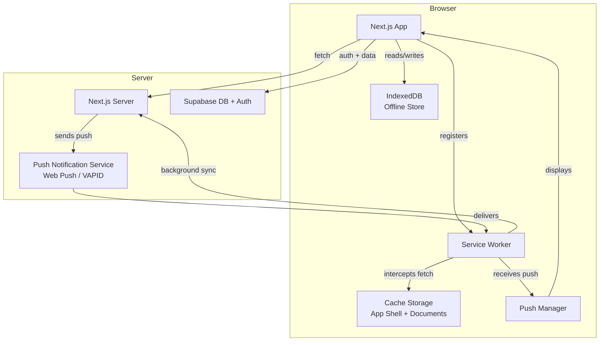

# Design Document: PWA Mobile Experience

## Overview

This feature transforms Vibe Trip into a fully installable Progressive Web App (PWA) optimized for mobile travelers. The implementation covers five major areas: installability (Web App Manifest + install prompt), offline resilience (Service Worker + IndexedDB caching), push notifications (Web Push API), mobile-native UI (bottom nav, swipe gestures, pull-to-refresh), and an offline document viewer.

The app is built on Next.js 14 (App Router, `src/` directory) with Tailwind CSS and shadcn/ui. The PWA layer sits on top of the existing architecture without replacing it — the Service Worker intercepts network requests, IndexedDB stores structured trip data, and new React components handle mobile-specific UI patterns.

**Key design decisions:**
- Use `next-pwa` (based on Workbox) to integrate Service Worker generation into the Next.js build pipeline, avoiding manual SW management.
- Use `idb` (a thin IndexedDB wrapper) for the Offline Store — avoids raw IndexedDB complexity while staying lightweight.
- Push notifications use the standard Web Push protocol with VAPID keys; the Supabase database stores push subscriptions.
- The bottom navigation bar is a new component that replaces the existing tab system on mobile viewports, keeping desktop layout unchanged.

---

## Architecture



**Request flow (online):** App → Next.js server → Supabase. Service Worker uses a network-first strategy for API calls and cache-first for static assets.

**Request flow (offline):** App → Service Worker → Cache (App Shell) / IndexedDB (trip data). Write actions are queued via Background Sync and replayed when connectivity returns.

---

## Components and Interfaces

### New Files

| Path | Purpose |
|------|---------|
| `public/manifest.json` | Web App Manifest |
| `public/sw.js` | Generated Service Worker (via next-pwa) |
| `public/icons/` | PWA icon set (192, 512, maskable) |
| `src/lib/offline-store.ts` | IndexedDB wrapper (idb) |
| `src/lib/background-sync.ts` | Background Sync queue manager |
| `src/lib/push-notifications.ts` | Push subscription helpers |
| `src/lib/connectivity.ts` | Network state utilities |
| `src/hooks/useOfflineStore.ts` | React hook for offline data |
| `src/hooks/useConnectivity.ts` | React hook for online/offline state |
| `src/hooks/usePushNotifications.ts` | React hook for push permission + subscription |
| `src/hooks/usePullToRefresh.ts` | Pull-to-refresh gesture hook |
| `src/components/pwa/OfflineBanner.tsx` | Persistent offline status banner |
| `src/components/pwa/InstallPrompt.tsx` | Custom install prompt UI |
| `src/components/pwa/UpdatePrompt.tsx` | SW update notification |
| `src/components/pwa/DownloadTripButton.tsx` | "Download for Offline" action |
| `src/components/pwa/OfflineStorageInfo.tsx` | Storage size + last-downloaded display |
| `src/components/trip/MobileBottomNav.tsx` | Bottom navigation bar (mobile) |
| `src/components/trip/SwipeableTabs.tsx` | Swipe gesture tab container |
| `src/app/api/push/subscribe/route.ts` | Store push subscription |
| `src/app/api/push/unsubscribe/route.ts` | Remove push subscription |
| `src/app/api/push/send/route.ts` | Internal endpoint to trigger push |

### Modified Files

| Path | Change |
|------|--------|
| `next.config.ts` | Add `next-pwa` plugin configuration |
| `src/app/layout.tsx` | Add manifest link, Apple meta tags, theme-color, SW registration |
| `src/views/TripDetail.tsx` | Integrate bottom nav, offline data hooks, download button |
| `src/components/trip/TripChat.tsx` | Offline queue for messages, cached history display |

### Key Interfaces

```typescript
// src/lib/offline-store.ts
interface OfflineTripData {
  tripId: string;
  downloadedAt: number; // Unix timestamp
  storageBytes: number;
  itinerary: ItineraryItem[];
  bookings: Booking[];
  members: TripMember[];
  expenses: ExpenseSummary;
  documents: DocumentMeta[];
}

interface BackgroundSyncAction {
  id: string;
  tripId: string;
  type: 'send_message' | 'add_expense' | 'vote_poll';
  payload: unknown;
  createdAt: number;
  retryCount: number;
}

// src/lib/push-notifications.ts
interface PushSubscriptionRecord {
  userId: string;
  tripId: string | null; // null = global subscription
  endpoint: string;
  keys: { p256dh: string; auth: string };
  mutedTrips: string[];
  mutedTypes: ('chat' | 'poll')[];
}
```

---

## Data Models

### IndexedDB Schema (via `idb`)

Database name: `vibe-trip-offline`, version 1.

| Store | Key | Value | Indexes |
|-------|-----|-------|---------|
| `trips` | `tripId` | `OfflineTripData` | `downloadedAt` |
| `sync-queue` | `id` (auto) | `BackgroundSyncAction` | `tripId`, `type` |
| `install-prompt` | `'state'` | `{ dismissedAt: number }` | — |

### Supabase Tables (new)

```sql
-- Push subscriptions
create table push_subscriptions (
  id uuid primary key default gen_random_uuid(),
  user_id uuid references auth.users not null,
  endpoint text not null unique,
  p256dh text not null,
  auth_key text not null,
  muted_trips uuid[] default '{}',
  muted_chat_trips uuid[] default '{}',
  muted_poll_trips uuid[] default '{}',
  created_at timestamptz default now(),
  updated_at timestamptz default now()
);
```

### Cache Storage Buckets

| Cache Name | Contents | Strategy |
|-----------|----------|----------|
| `app-shell-v{hash}` | HTML, CSS, JS bundles, fonts, icons | Cache-first |
| `trip-documents-v1` | PDF/image document files | Cache-first on download |
| `api-runtime` | API responses (short TTL) | Network-first, fallback to cache |

---

## Correctness Properties

*A property is a characteristic or behavior that should hold true across all valid executions of a system — essentially, a formal statement about what the system should do. Properties serve as the bridge between human-readable specifications and machine-verifiable correctness guarantees.*

### Property 1: Install prompt 30-day suppression

*For any* dismissal timestamp stored in the Offline Store, the install prompt should not be displayed if fewer than 30 days (2,592,000,000 ms) have elapsed between that timestamp and the current time.

**Validates: Requirements 1.4**

---

### Property 2: Offline store round trip

*For any* trip whose data is written to the Offline Store (either via auto-cache on page open or explicit download), reading that trip's itinerary, bookings, member list, and expense summary back from the store should return data structurally equivalent to what was written.

**Validates: Requirements 3.1, 3.2, 4.2**

---

### Property 3: Background sync queue integrity

*For any* write action (send message, add expense, vote poll) enqueued while offline, that action should appear in the sync queue exactly once, and after a successful sync replay it should be removed from the queue.

**Validates: Requirements 3.4, 3.5**

---

### Property 4: Failed sync action retained in queue

*For any* Background Sync action that fails after connectivity is restored, the action should remain in the sync queue with an incremented retry count, and the user should be notified of the failure.

**Validates: Requirements 3.6**

---

### Property 5: Push subscription stored on permission grant

*For any* push subscription object generated after a user grants notification permission, storing then retrieving that subscription from the `push_subscriptions` table should return a record with equivalent endpoint and key fields.

**Validates: Requirements 5.2**

---

### Property 6: Muted trip receives no notifications

*For any* user and any trip ID present in that user's muted list (for a given notification type — chat or poll), the `shouldNotify(userId, tripId, type)` function should return false.

**Validates: Requirements 5.9, 5.10**

---

### Property 7: Offline banner matches connectivity state

*For any* sequence of online/offline connectivity transitions, the offline banner's visibility should always equal the inverse of the current `navigator.onLine` value — visible when offline, hidden when online.

**Validates: Requirements 8.2, 8.3**

---

### Property 8: Document cache round trip

*For any* document blob fetched and stored in Cache Storage during a trip download, retrieving that document from the cache while offline should return bytes identical to what was stored.

**Validates: Requirements 7.1, 7.2**

---

### Property 9: Storage size accuracy

*For any* `OfflineTripData` object written to IndexedDB, the storage size reported by `calculateStorageSize(data)` should be within a 5% tolerance of the actual serialized byte length of that data.

**Validates: Requirements 4.7**

---

### Property 10: Push notification eligibility filtering

*For any* chat message or poll event in a trip, the set of users who receive a push notification should be exactly the set of users who (a) have granted notification permission, (b) have not muted that notification type for that trip, and (c) are not currently viewing the relevant trip content.

**Validates: Requirements 5.3, 5.4, 5.5**

---

### Property 11: Permission denial suppresses re-request in session

*For any* session in which the user has denied notification permission, calling `requestNotificationPermission()` should not invoke `Notification.requestPermission()` again within that same session.

**Validates: Requirements 5.8**

---

### Property 12: Document list renders required metadata fields

*For any* document in a trip's document list, the rendered list item should contain the document's file name, file type, and file size.

**Validates: Requirements 7.5**

---

### Property 13: Connectivity status message accuracy

*For any* connectivity state (fully online, fully offline, or degraded/timing-out), the status message displayed to the user should correspond to the correct state — no message when online, "offline" banner when fully offline, "slow connection" indicator when degraded.

**Validates: Requirements 8.4**

---

## Error Handling

| Scenario | Behavior |
|----------|----------|
| Service Worker registration fails | App continues as standard web app; no error shown to user (Req 2.6) |
| Download fails mid-way | Partial data is discarded; user is shown an error with retry option |
| Background sync action fails after reconnect | User is notified; action remains in queue for manual retry (Req 3.6) |
| Push permission denied | No re-request in same session; settings page shows path to enable (Req 5.8) |
| Storage below 50 MB at download start | Warning dialog shown before proceeding (Req 4.8) |
| Document not downloaded before going offline | Inline message: "Unavailable offline — download when connected" (Req 7.4) |
| Degraded connection (timeouts) | Distinct status message from full offline: "Connection is slow" (Req 8.4) |
| SW update available | Non-blocking toast with "Refresh to update" action (Req 2.4, 2.5) |

---

## Testing Strategy

### Unit Tests

Focus on specific examples, edge cases, and pure logic:

- `offline-store.ts`: read/write/delete operations, storage size calculation
- `background-sync.ts`: queue add, dequeue, retry logic
- `push-notifications.ts`: subscription serialization, mute preference logic
- `connectivity.ts`: state machine transitions (online → offline → online)
- `InstallPrompt`: renders when criteria met, hidden after dismissal, 30-day suppression logic
- `OfflineBanner`: visible when offline, hidden when online
- `DownloadTripButton`: progress states, error state, confirmation on complete

### Property-Based Tests

Use **fast-check** (TypeScript-native PBT library) with a minimum of 100 iterations per property.

Each test is tagged with: `// Feature: pwa-mobile-experience, Property N: <property_text>`

| Property | Test Description |
|----------|-----------------|
| P1: Install prompt suppression | For any dismissal timestamp, prompt should not show if `Date.now() - dismissedAt < 30 days` |
| P2: Offline store round trip | For any generated `OfflineTripData`, write → read should produce structurally equivalent data |
| P3: Background sync queue integrity | For any sequence of offline actions, each appears in queue exactly once and is removed after successful sync |
| P4: Failed sync retained in queue | For any failed sync action, it remains in queue with incremented retry count |
| P5: Push subscription stored | For any valid push subscription, store → retrieve returns equivalent record |
| P6: Muted trip no notifications | For any trip ID in user's muted list, `shouldNotify(userId, tripId, type)` returns false |
| P7: Offline banner state | For any sequence of online/offline transitions, banner visibility always matches current connectivity state |
| P8: Document cache round trip | For any document blob, cache → retrieve returns identical bytes |
| P9: Storage size accuracy | For any `OfflineTripData`, `calculateStorageSize(data)` is within 5% of actual serialized byte length |
| P10: Push eligibility filtering | For any trip event, notified users are exactly those with permission, not muted, and not currently viewing |
| P11: Permission denial suppresses re-request | For any session with denied permission, `requestNotificationPermission()` does not call `Notification.requestPermission()` again |
| P12: Document list renders required fields | For any document, rendered list item contains file name, type, and size |
| P13: Connectivity status message accuracy | For any connectivity state, displayed message corresponds to correct state |

**Property test configuration:**
```typescript
// fast-check default runs 100 iterations; increase for critical paths
fc.configureGlobal({ numRuns: 200 });
```
